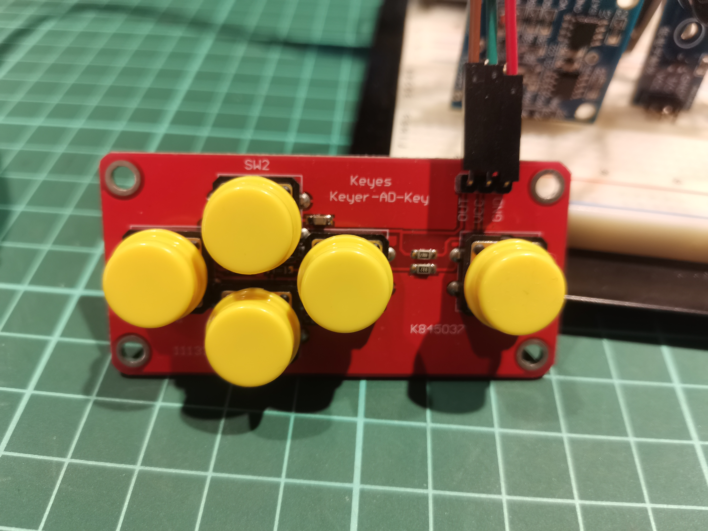

# ReadMe
The repository is dedicated to a course at National Chengchi University.
* Course Name: Interactive Technologies and Prototyping
* Course ID: 781040001
* Semester: Spring 2021 (1092)

The student IDs of the two primarily responsible for the final project are listed below:
* 106308049
* 107504031

### Shortcuts
1. Midterm Demo (the foundation for the final project). Please click [here](https://github.com/xczian/nccu_prototype/tree/master/midterm)
2. Final Project - Playful Alarm with Snake. Please click [here](https://github.com/xczian/nccu_prototype/tree/master/final)

### Description
The final project was to combine alarm clock and the classic game, Snake. On the premise of many traditional counterparts being ineffective by experience, we set out to make one without much discomfort. The theme of pacman was used to replace the monotone noise. By implementing background music, configuring monitor refresh rate, and designing game status computation, we produced a prototype that is playful but suitable for real-world use.

